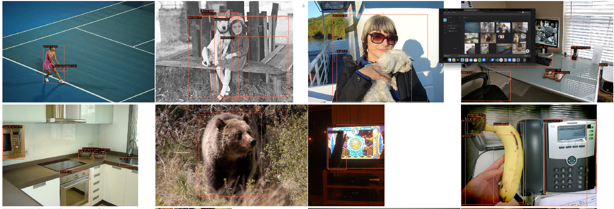

<h1 align="center">Efficient Channel Attention:<br>Reproducibility Challenge 2020</h1>
<p align="center">CVPR 2020 <a href="https://openaccess.thecvf.com/content_CVPR_2020/html/Wang_ECA-Net_Efficient_Channel_Attention_for_Deep_Convolutional_Neural_Networks_CVPR_2020_paper.html" target="_blank">(Official Paper)</a></p>

<p align="center">
    <a href="https://arxiv.org/abs/1910.03151" alt="ArXiv">
        </a>
    <a href="https://openaccess.thecvf.com/content_CVPR_2020/html/Wang_ECA-Net_Efficient_Channel_Attention_for_Deep_Convolutional_Neural_Networks_CVPR_2020_paper.html"                     alt="CVF">
          </a>
    <a href="https://openaccess.thecvf.com/content_CVPR_2020/papers/Wang_ECA-Net_Efficient_Channel_Attention_for_Deep_Convolutional_Neural_Networks_CVPR_2020_paper.pdf"                        alt="PDF">
          </a>
    <a href="https://openaccess.thecvf.com/content_CVPR_2020/supplemental/Wang_ECA-Net_Efficient_Channel_CVPR_2020_supplemental.pdf" alt="Supp">
          </a>
    <a href="https://www.youtube.com/watch?v=ipZ2AS1b0rI" alt="Video">
          </a>
    <a href="https://mybinder.org/v2/gh/digantamisra98/Reproducibilty-Challenge-ECANET/HEAD" alt="ArXiv">
        </a>
    <a href="https://twitter.com/DigantaMisra1" alt="Twitter">
          </a>
    <br>
    <a href="https://wandb.ai/diganta/ECANet-sweep?workspace=user-diganta" alt="Dashboard">
        </a>
    <a href="https://wandb.ai/diganta/ECANet-sweep/reports/ECA-Net-Efficient-Channel-Attention-for-Deep-Convolutional-Neural-Networks-NeurIPS-Reproducibility-Challenge-2020--VmlldzozODU0NTM" alt="RC2020">
        </a>
    <a href="https://wandb.ai/diganta/ECANet-sweep/reports/Efficient-Channel-Attention--VmlldzozNzgwOTE" alt="Report">
        </a>
    <a href="https://github.com/BangguWu/ECANet" alt="Report">
        </a>
    <a href="https://blog.paperspace.com/attention-mechanisms-in-computer-vision-ecanet/" alt="Report">
        </a>
</p>

<p align="center">
    
    </br>
    <em>Bounding Box and Segmentation Maps of ECANet-50-Mask-RCNN using samples from the test set of MS-COCO 2017 dataset.</em>
</p>

# Introduction

<p float="center">
    
    <br>
    <em>Structural comparison of SE and ECA attention mechanism.</em>
</p>

## How to run:

#### Install Dependencies:

```
pip install -r requirements.txt
```

This reproduction is build on PyTorch and MMDetection. Ensure you have CUDA Toolkit > 10.1 installed. For more details regarding installation of MMDetection, please visit this [resources page](https://mmdetection.readthedocs.io/en/latest/get_started.html#installation).

### MS-COCO:

<p align="left">
    
    <br>
    <em>Training progress of ECANet-50-Mask-RCNN for 12 epochs.</em>
</p>

##### Reproduced Results:

|Backbone|Detectors|BBox_AP|BBox_AP<sub>50</sub>|BBox_AP<sub>75</sub>|BBox_AP<sub>S</sub>|BBox_AP<sub>M</sub>|BBox_AP<sub>L</sub>|Segm_AP|Segm_AP<sub>50</sub>|Segm_AP<sub>75</sub>|Segm_AP<sub>S</sub>|Segm_AP<sub>M</sub>|Segm_AP<sub>L</sub>|Weights|
|:---:|:---:|:---:|:---:|:---:|:---:|:---:|:---:|:---:|:---:|:---:|:---:|:---:|:---:|:---:|
|ECANet-50|Mask RCNN|**34.1**|**53.4**|**37.0**|**21.1**|**37.2**|**42.9**|**31.4**|**50.6**|**33.2**|**18.1**|**34.3**|**41.1**|[Google Drive](https://drive.google.com/file/d/1IrxmSDDOzHKBJPkXYvCHNe-Koqm3Idtq/view?usp=sharing)|

#### Download MS-COCO 2017:

Simply execute [this script](https://gist.githubusercontent.com/mkocabas/a6177fc00315403d31572e17700d7fd9/raw/a6ad5e9d7567187b65f222115dffcb4b8667e047/coco.sh) in your terminal to download and process the MS-COCO 2017 dataset. You can use the following command to do the same:
```
curl https://gist.githubusercontent.com/mkocabas/a6177fc00315403d31572e17700d7fd9/raw/a6ad5e9d7567187b65f222115dffcb4b8667e047/coco.sh | sh
```

#### Training:

This project uses [MMDetection](https://github.com/open-mmlab/mmdetection) for training the Mask RCNN model. One would require to make the following changes in the following file in the cloned source of MMDetection codebase to train the detector model.
    
- `mmdetection/configs/_base_/schedules/schedule_1x.py`
    If you're training on 1 GPU, you would require to lower down the LR for the scheduler since MMDetection default LR strategy is set for 8 GPU based training. Simply go to this file and edit the optimizer definition with the lr value now being `0.0025`.

After making the following changes to run the training, use the following command:
```
python tools/train.py mmdetection/configs/mask_rcnn/mask_rcnn_r50_fpn_1x_coco.py
```

To resume training from any checkpoint, use the following command (for example - Epoch 5 in this case):
```
python tools/train.py configs/mask_rcnn/mask_rcnn_r50_fpn_1x_coco.py --resume-from work_dirs/mask_rcnn_r50_fpn_1x_coco/epoch_5.pth
```

#### Inference:

To run inference, simply run [this notebook](https://github.com/digantamisra98/Reproducibilty-Challenge-ECANET/blob/main/inference_demo.ipynb).

##### Logs:

The logs are provided in the [Logs folder](https://github.com/digantamisra98/Reproducibilty-Challenge-ECANET/tree/main/logs). It contains two files:
1. ```20210102_160817.log```: Contains logs from epoch 1 to epoch 6

## WandB logs:

The dashboard for this project can be accessed [here](https://wandb.ai/diganta/ECANet-sweep?workspace=user-diganta).

##### Machine Specifications and Software versions:

- torch: 1.7.1+cu110
- GPU: 1 NVIDA V100, 16GB Memory on GCP

## Cite:

```
@InProceedings{Wang_2020_CVPR,
author = {Wang, Qilong and Wu, Banggu and Zhu, Pengfei and Li, Peihua and Zuo, Wangmeng and Hu, Qinghua},
title = {ECA-Net: Efficient Channel Attention for Deep Convolutional Neural Networks},
booktitle = {Proceedings of the IEEE/CVF Conference on Computer Vision and Pattern Recognition (CVPR)},
month = {June},
year = {2020}
}
```

<p align="center">
    Made with ❤️ and ⚡
</p>

