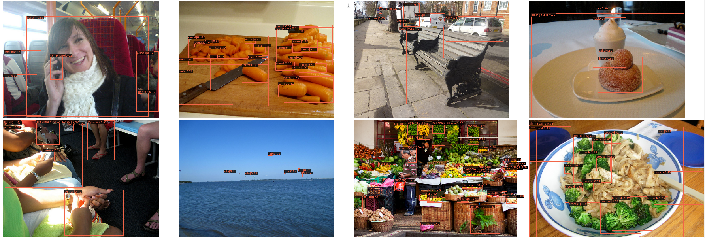

<h1 align="center">Dynamic RCNN:<br>Reproducibility Challenge 2020</h1>
<p align="center">ECCV 2020 <a href="https://www.ecva.net/papers/eccv_2020/papers_ECCV/papers/123600256.pdf" target="_blank">(Official Paper)</a></p>

<p align="center">
    <a href="https://arxiv.org/abs/2004.06002" alt="ArXiv">
        </a>
    <a href="https://www.ecva.net/papers/eccv_2020/papers_ECCV/papers/123600256.pdf"                        alt="PDF">
          </a>
    <a href="https://youtu.be/PNoEBRTHZqE" alt="Video">
          </a>
    <a href="https://wandb.ai/avantikamishra/mmdetection-tools?workspace=user-avantikamishra" alt="Dashboard">
        </a>
    <a href="https://github.com/hkzhang95/DynamicRCNN" alt="Report">
        </a>
</p>

<p align="center">
    
    </br>
    <em>Bounding Box results of Dynamic-RCNN using samples from the test set of MS-COCO 2017 dataset.</em>
</p>

# Introduction

<p float="center">
    
    <br>
    <em>Structural comparison of SE and ECA attention mechanism.</em>
</p>

*Although two-stage object detectors have continuously advanced the state-of-the-art performance in recent years, the training process itself is far from crystal. In this work, we first point out the inconsistency problem between the fixed network settings and the dynamic training procedure, which greatly affects the performance. For example, the fixed label assignment strategy and regression loss function cannot fit the distribution change of proposals and are harmful to training high quality detectors. Then, we propose Dynamic R-CNN to adjust the label assignment criteria (IoU threshold) and the shape of regression loss function (parameters of SmoothL1 Loss) automatically based on the statistics of proposals during training. This dynamic design makes better use of the training samples and pushes the detector to fit more high quality samples. Specifically, our method improves upon ResNet-50-FPN baseline with 1.9% AP and 5.5% AP90 on the MS COCO dataset with no extra overhead.*

## How to run:

#### Install Dependencies:

```
pip install -r requirements.txt
```

This reproduction is build on PyTorch and MMDetection. Ensure you have CUDA Toolkit > 10.1 installed. For more details regarding installation of MMDetection, please visit this [resources page](https://mmdetection.readthedocs.io/en/latest/get_started.html#installation).

### MS-COCO:

##### Reproduced Results:

|Backbone|Detectors|BBox_AP|BBox_AP<sub>50</sub>|BBox_AP<sub>75</sub>|BBox_AP<sub>S</sub>|BBox_AP<sub>M</sub>|BBox_AP<sub>L</sub>|Weights|
|:---:|:---:|:---:|:---:|:---:|:---:|:---:|:---:|:---:|
|ResNet-50|Dynamic RCNN|**38.9**|**57.5**|**42.8**|**21.9**|**41.9**|**51.1**|[Google Drive](https://drive.google.com/file/d/1o9sUGu37jKs7_Yx6Uyp7dQazbnT2yycx/view?usp=sharing)|

#### Download MS-COCO 2017:

Simply execute [this script](https://gist.github.com/avantikamishra96/5bda3aa5c76fb3b3a5a4b1ba59df6bbd) in your terminal to download and process the MS-COCO 2017 dataset. You can use the following command to do the same:
```
curl https://gist.github.com/avantikamishra96/5bda3aa5c76fb3b3a5a4b1ba59df6bbd | sh
```

#### Training:

This project uses [MMDetection](https://github.com/open-mmlab/mmdetection) for training the Mask RCNN model. One would require to make the following changes in the following file in the cloned source of MMDetection codebase to train the detector model.
    
- `mmdetection/configs/_base_/schedules/schedule_1x.py`
    If you're training on 1 GPU, you would require to lower down the LR for the scheduler since MMDetection default LR strategy is set for 8 GPU based training. Simply go to this file and edit the optimizer definition with the lr value now being `0.0025`.

After making the following changes to run the training, use the following command:
```
python tools/train.py mmdetection/configs/dynamic_rcnn/dynamic_rcnn_r50_fpn_1x_coco.py
```

To resume training from any checkpoint, use the following command (for example - Epoch 5 in this case):
```
python tools/train.py configs/dynamic_rcnn/dynamic_rcnn_r50_fpn_1x_coco.py --resume-from work_dirs/dynamic_rcnn_r50_fpn_1x_coco/epoch_5.pth
```

#### Inference:


##### Logs:

Full logs are available [here](/dynamic_rcnn.log).

## WandB logs:

The dashboard for this project can be accessed [here](https://wandb.ai/avantikamishra/mmdetection-tools?workspace=user-avantikamishra).

##### Machine Specifications and Software versions:

- torch: 1.7.2+cu110
- GPU: 1 NVIDA V100, 32 GB memory for 8 CPUs

## Cite:

```
@inproceedings{zhang2020dynamic,
  title={Dynamic R-CNN: Towards high quality object detection via dynamic training},
  author={Zhang, Hongkai and Chang, Hong and Ma, Bingpeng and Wang, Naiyan and Chen, Xilin},
  booktitle={European Conference on Computer Vision},
  pages={260--275},
  year={2020},
  organization={Springer}
}
```

<p align="center">
    Made with ❤️ and ⚡
</p>

